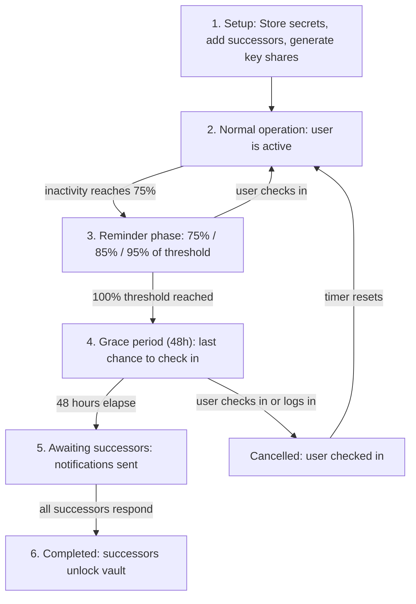
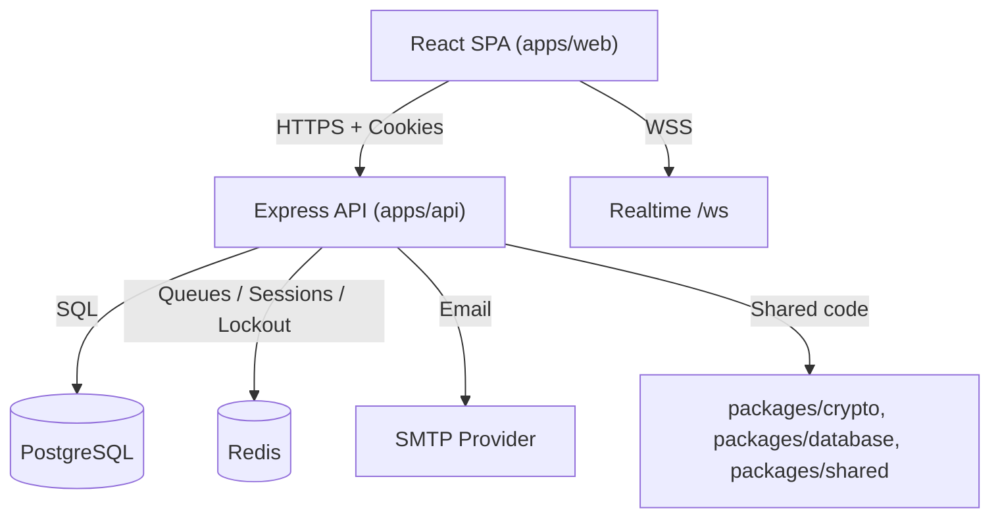

<div align="center">

# HandoverKey

Open-source zero-knowledge digital legacy platform and dead man's switch.

[](https://github.com/HandoverKey/HandoverKey/actions/workflows/ci.yml)
[](https://opensource.org/licenses/MIT)
[](https://github.com/HandoverKey/HandoverKey/releases)
[](https://nodejs.org/)
[](https://www.typescriptlang.org/)
[](http://makeapullrequest.com)
[](SECURITY.md)

[Features](#key-features) • [How It Works](#how-it-works) • [Quick Start](#quick-start) • [Architecture](#architecture) • [Documentation](#documentation) • [Contributing](#contributing)

</div>

---

## About

HandoverKey helps users protect and eventually transfer access to critical digital
information without giving the service provider access to plaintext vault data.

The platform works as a dead man's switch:

1. A user stores encrypted secrets in the vault.
2. The user configures inactivity settings and trusted successors.
3. If the user fails to check in, the system sends reminders and enters a grace period.
4. Once the handover flow is triggered, verified successors can access only the data
   the user has made available to them.

## Project Status

`v1.1.1` is the current release. <!-- x-release-please-version -->

The repository now ships a production-grade web app and API with:

- client-side encrypted vault storage
- TOTP 2FA with recovery codes and password strength enforcement
- secure session management with httpOnly cookies
- activity logs and secure check-in links
- vault import/export
- successor verification, per-entry access restrictions, and key share generation
- handover orchestration with HTTP endpoints for status, cancellation, and successor response
- guided onboarding checklist for new users
- interactive FAQ covering zero-knowledge security and handover mechanics
- realtime WebSocket notifications
- role-based admin dashboard and operational APIs

Roadmap items such as mobile clients, passkeys, and broader multi-platform support
remain future work.

## Key Features

- **Zero-knowledge vault storage**: secrets are encrypted client-side with AES-256-GCM
  before they are sent to the API.
- **Dead man's switch orchestration**: configurable inactivity thresholds (30--365 days),
  graduated reminders, a 48-hour grace period, and manual/public check-in flows.
- **Handover API**: dedicated endpoints for handover status, cancellation, and
  public successor accept/decline with rate limiting and Zod validation.
- **Successor controls**: verified successors, Shamir's Secret Sharing key distribution
  with configurable threshold, and optional per-successor vault entry restrictions.
- **Strong account security**: httpOnly cookie auth, server-side session validation,
  TOTP 2FA with collapsible login UI, recovery codes, password strength enforcement,
  lockout protection, and request validation.
- **Guided onboarding**: first-time users see a checklist tracking vault setup,
  successor designation, key share generation, and inactivity configuration.
- **Operational visibility**: role-gated admin dashboard, activity logs, health checks,
  background job monitoring, and structured logging.
- **Realtime UX**: WebSocket-based user notifications for reminders and handover
  state changes.
- **Portable data**: encrypted vault export/import to support backup and migration.
- **Accessible UI**: consistent component library, ARIA-compliant tooltips,
  keyboard-navigable controls, and formatted successor vault views.

## How It Works

### The Handover Lifecycle

The complete flow from setup to vault unlock:



**Step 1 -- Setup.** The user creates an account, adds secrets to the
zero-knowledge vault (encrypted client-side with AES-256-GCM), designates trusted
successors, and generates key shares. The user also configures an inactivity
threshold (30--365 days, default 90).

**Step 2 -- Normal operation.** Logins and key authenticated actions, such as
vault access or a manual check-in, reset the user's last-activity timestamp.
An in-process monitor evaluates each user's inactivity against their configured
threshold every 15 minutes, with an additional hourly BullMQ job as a backstop.

**Step 3 -- Reminder phase.** As inactivity approaches the threshold, the system
sends graduated email reminders. Each reminder includes a secure one-click check-in
link (valid 7 days) so the user can reset the timer without logging in:

| Threshold reached | Reminder level  | Cooldown between sends |
| ----------------- | --------------- | ---------------------- |
| 75%               | First reminder  | 24 hours               |
| 85%               | Second reminder | 12 hours               |
| 95%               | Final warning   | 6 hours                |

**Step 4 -- Grace period.** When inactivity hits 100%, the system initiates a
handover process with a 48-hour grace period (configurable via `GRACE_PERIOD_HOURS`).
During this window the user can still cancel the handover by logging in, manually
checking in, or using a check-in link. Successors are **not** notified during the
grace period.

**Step 5 -- Awaiting successors.** After the grace period expires, the handover
transitions to `awaiting_successors`. Each successor receives an email containing a
unique access link. Successors can accept or decline the handover via the public
`POST /api/v1/handover/respond` endpoint. The handover completes once every
notified successor has responded (accept or decline).

**Step 6 -- Vault unlock.** An accepted successor visits their access link, enters
their key share plus shares collected from other successors, and the browser
reconstructs the master key client-side using Shamir's Secret Sharing. The
reconstructed key decrypts each vault entry locally -- the server never sees
plaintext data.

### Shamir's Secret Sharing -- Key Splits and Scenarios

HandoverKey uses [Shamir's Secret Sharing](https://en.wikipedia.org/wiki/Shamir%27s_secret_sharing)
to split the user's master encryption key into N shares with a threshold of K.
Any K shares can reconstruct the key; fewer than K shares reveal nothing.

The threshold is determined by the user's `requireMajority` setting:

| Setting               | Threshold (K)      | Example with 4 successors |
| --------------------- | ------------------ | ------------------------- |
| `requireMajority` off | `min(2, N)`        | 2-of-4                    |
| `requireMajority` on  | `floor(N / 2) + 1` | 3-of-4                    |

**Scenario A -- 3 successors, majority required (2-of-3):**

```text
Master Key --> split into 3 shares (threshold = 2)

  Share 1 --> Successor A (spouse)
  Share 2 --> Successor B (sibling)
  Share 3 --> Successor C (attorney)

Unlock: any 2 successors combine shares --> master key --> decrypt vault
```

If Successor C is unreachable, A and B can still unlock the vault. If only one
successor has their share, the vault remains sealed.

**Scenario B -- 5 successors, majority required (3-of-5):**

```text
Master Key --> split into 5 shares (threshold = 3)

Unlock: any 3 of the 5 successors combine shares --> master key
```

Even if 2 successors lose their shares or decline, the remaining 3 can
reconstruct the key. No single successor or pair can access data alone.

**Scenario C -- 2 successors, minimum threshold (2-of-2):**

```text
Master Key --> split into 2 shares (threshold = 2)

Unlock: both successors must cooperate --> master key
```

This is the strictest setting -- both parties must participate. If either
successor is unavailable, the vault cannot be unlocked.

### Conflict Resolution

**Successor declines.** A decline counts as a response. Once all successors have
responded (whether they accepted or declined), the handover completes. Declined
successors simply don't participate in key reconstruction, but the handover itself
is not blocked.

**Not enough shares to meet threshold.** If too many successors decline or are
unreachable and the remaining accepted successors hold fewer than K shares, the
master key cannot be reconstructed. The vault remains sealed. This is by design --
it prevents unauthorized access when quorum is not met.

**User returns during grace period.** Any of these actions cancel the handover and
reset the inactivity timer:

- Logging in
- Clicking a check-in link from a reminder email
- Manually checking in from the dashboard

Since successors are only notified after the grace period, a cancelled handover is
invisible to them.

**User returns after successors are notified.** The user can still cancel an
active handover via `POST /api/v1/handover/cancel`. Successors who were already
notified receive a cancellation notice.

**User pauses the switch.** The inactivity tracker can be paused (indefinitely or
until a specific date) via the settings page. While paused, no threshold checks or
reminders run.

## Architecture

HandoverKey is a Turbo monorepo with two deployable apps and three shared packages.



### Repository Layout

```text
apps/
  api/   Express 5 API — controllers, services, jobs, validation, handover orchestration
  web/   React 19 SPA — pages, components, contexts, encryption service
packages/
  crypto/    AES-256-GCM, PBKDF2, Shamir's Secret Sharing (Web Crypto API)
  database/  Kysely client, repository layer, schema types
  shared/    Cross-package types, constants, validation utilities
docs/
  API contract, architecture, deployment, security, testing
```

See [`docs/architecture.md`](docs/architecture.md) for the detailed runtime model.

## Quick Start

### Prerequisites

- Node.js 22+
- npm 9+
- Docker (for PostgreSQL and Redis in local development)

### Local setup

```bash
git clone https://github.com/HandoverKey/HandoverKey.git
cd HandoverKey
npm install

cp apps/api/.env.example apps/api/.env
cp apps/web/.env.example apps/web/.env

# Generate strong secrets for the API env file.
# Example:
# JWT_SECRET=$(openssl rand -base64 48)
# ACTIVITY_HMAC_SECRET=$(openssl rand -base64 48)

npm run docker:up
npm run db:migrate
npm run build
npm run dev
```

Default local URLs:

- Web app: `http://localhost:5173`
- API: `http://localhost:3001`
- API base path: `http://localhost:3001/api/v1`

## Testing And Quality

```bash
npm run lint
npm run test
npm run build
```

Test tooling by workspace:

- `apps/web`: Vitest + Testing Library (auth flows, vault operations, UX polish)
- `apps/api`: Jest integration tests (auth, vault CRUD, handover routes, inactivity)
- `packages/crypto`: Jest with 80% coverage threshold
- `packages/database`: Jest repository and client tests
- `packages/shared`: Jest utility tests

Pre-commit hooks run Prettier and ESLint on staged files.

## Documentation

- [`docs/README.md`](docs/README.md): docs index and reading guide
- [`docs/api.md`](docs/api.md): current API contract and auth model
- [`docs/architecture.md`](docs/architecture.md): runtime topology and package boundaries
- [`docs/deployment.md`](docs/deployment.md): local, container, and hosted deployment notes
- [`docs/security.md`](docs/security.md): implemented security model and limitations
- [`docs/testing.md`](docs/testing.md): test workflows and coverage expectations
- [`CONTRIBUTING.md`](CONTRIBUTING.md): contribution workflow and quality bar

## Security

Security issues should not be reported through public GitHub issues.

Please read [`SECURITY.md`](SECURITY.md) and report vulnerabilities to
`security@handoverkey.com`.

## Contributing

Contributions are welcome, including bug fixes, docs updates, tests, and new features.

Before opening a pull request:

1. Make your change on a branch created from `main`.
2. Add or update tests for behavior changes.
3. Update docs if the API, UI, or deployment contract changed.
4. Run `npm run lint && npm run test && npm run build`.

Full guidance lives in [`CONTRIBUTING.md`](CONTRIBUTING.md).

## Troubleshooting

| Problem                                              | Suggested fix                                                       |
| ---------------------------------------------------- | ------------------------------------------------------------------- |
| Docker services fail to start                        | Check Docker Desktop / daemon status and rerun `npm run docker:up`  |
| API fails during startup validation                  | Verify `JWT_SECRET`, `ACTIVITY_HMAC_SECRET`, DB, and Redis env vars |
| Web app cannot talk to API in production             | Set `VITE_API_URL` and `VITE_WS_URL` explicitly                     |
| Guest visits redirect strangely on hosted SPA routes | Ensure SPA rewrites are configured (see `apps/web/vercel.json`)     |

## Roadmap

- Mobile applications
- Passkeys / WebAuthn
- Broader multi-language support
- Additional operator tooling and deployment automation

## License

Distributed under the MIT License. See [`LICENSE`](LICENSE).
