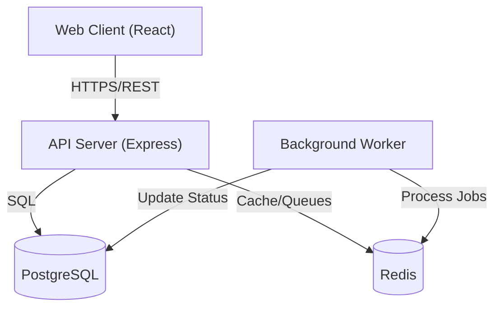
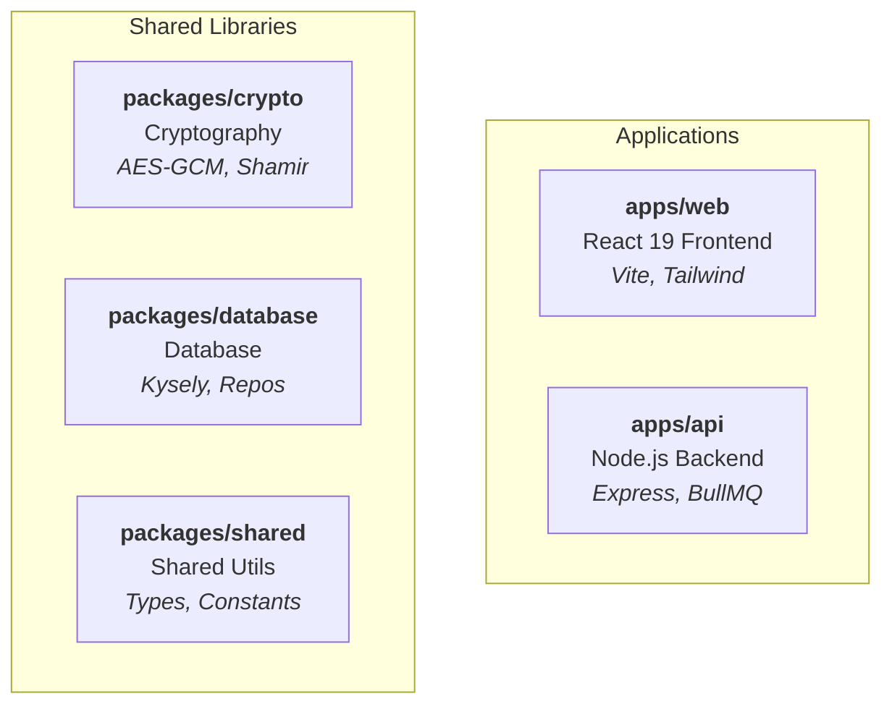

<div align="center">

# HandoverKey

**Zero-Knowledge Digital Legacy Platform & Dead Man's Switch**

[](https://github.com/HandoverKey/HandoverKey/actions/workflows/ci.yml)
[](https://opensource.org/licenses/MIT)
[](https://github.com/handoverkey/handoverkey/releases)
[](https://nodejs.org/)
[](https://www.typescriptlang.org/)
[](https://prettier.io/)
[](http://makeapullrequest.com)
[](SECURITY.md)

[Features](#key-features) • [Quick Start](#quick-start) • [Architecture](#architecture) • [Documentation](#documentation) • [Contributing](#contributing)

</div>

---

## About

**HandoverKey** is a secure, open-source digital legacy platform designed to ensure your critical digital assets (passwords, crypto keys, documents) are securely passed to your trusted contacts if something happens to you.

It operates as a **"Dead Man's Switch"**:

1.  You store encrypted secrets in your vault.
2.  You designate trusted successors.
3.  If you fail to check in for a configurable period (e.g., 90 days), the system initiates a handover protocol.
4.  Secrets are securely reconstructed and released to your verified successors.

### Why HandoverKey?

- **🛡️ Zero-Knowledge Architecture**: We cannot see your data. Encryption happens client-side (AES-256-GCM) before it ever leaves your device.
- **🔑 Shamir's Secret Sharing**: Split your encryption keys among multiple trusted contacts so no single person can access your data prematurely.
- **⚡ Production Ready**: Built with a modern stack, comprehensive observability, and rigorous testing.

---

## Key Features

- **Client-Side Encryption**: Web Crypto API implementation ensures data is opaque to the server.
- **Configurable Dead Man's Switch**: Set your check-in frequency and grace periods.
- **Multi-Party Handover**: Require $M$ of $N$ successors to collaborate to unlock your vault.
- **Secure Vault**: Manage passwords, notes, and files with a familiar interface.
- **Audit Logging**: Immutable logs of all access attempts and system events.
- **Background Processing**: Reliable job queues for inactivity monitoring and email notifications.

---

## Architecture

HandoverKey is built as a monorepo using [Turbo](https://turbo.build/).



### Project Structure



---

## Quick Start

Get running in 60 seconds with Docker:

```bash
git clone https://github.com/handoverkey/handoverkey.git && cd handoverkey
cp apps/api/.env.example apps/api/.env    # then set JWT_SECRET
npm install && npm run docker:up && npm run db:migrate && npm run build && npm run dev
```

Web App: `http://localhost:5173` | API: `http://localhost:3001`

---

## Getting Started

### Prerequisites

- **Node.js**: v22.0.0 or higher
- **Docker**: For running local infrastructure (PostgreSQL, Redis)
- **npm**: v9.0.0 or higher

### Installation

1.  **Clone the repository**

    ```bash
    git clone https://github.com/handoverkey/handoverkey.git
    cd handoverkey
    ```

2.  **Install dependencies**

    ```bash
    npm install
    ```

3.  **Environment Setup**
    Copy the example environment files and configure your secrets.

    ```bash
    cp apps/api/.env.example apps/api/.env
    cp apps/web/.env.example apps/web/.env
    # Edit .env files with your local configuration (JWT_SECRET is required)
    ```

4.  **Start Infrastructure**
    Spin up PostgreSQL and Redis using Docker Compose.

    ```bash
    npm run docker:up
    ```

5.  **Database Migration**
    Initialize the database schema.

    ```bash
    npm run db:migrate
    ```

6.  **Build Packages**
    Compile all shared packages and applications.

    ```bash
    npm run build
    ```

7.  **Start Development Servers**
    Launch the API and Web client in development mode.

    ```bash
    npm run dev
    ```

    - Web App: `http://localhost:5173`
    - API: `http://localhost:3001`

---

## Testing

We use **Vitest** for unit and integration testing.

```bash
# Run all tests across the monorepo
npm test

# Run tests for a specific workspace
npm test --workspace=@handoverkey/api

# Run tests with coverage report
npm test -- --coverage
```

---

## Security

Security is the core of HandoverKey.

- **Encryption**: AES-256-GCM for data, PBKDF2 (100k+ iterations) for key derivation.
- **Zero-Knowledge**: The server never sees the raw user password or the data encryption key (DEK).
- **Dependencies**: We minimize external dependencies to reduce supply chain attack surface.

For a deep dive into our security model, please read [docs/security.md](docs/security.md).

### Reporting Vulnerabilities

**Do not open GitHub issues for security vulnerabilities.**  
Please email security@handoverkey.com (placeholder) or refer to our [Security Policy](SECURITY.md).

---

## Documentation

- [**Architecture Guide**](docs/architecture.md): System design, component interaction, and data flow.
- [**API Reference**](docs/api.md): Endpoints, request/response schemas, and authentication.
- [**Testing Guide**](docs/testing.md): Test strategy, running tests, and writing new tests.
- [**Deployment**](docs/deployment.md): Docker and cloud deployment strategies.
- [**Security Model**](docs/security.md): Zero-knowledge architecture and encryption details.
- [**Contributing**](CONTRIBUTING.md): Guidelines for code style, PRs, and development workflow.

---

## Contributing

Contributions are what make the open-source community such an amazing place to learn, inspire, and create. Any contributions you make are **greatly appreciated**.

1.  Fork the Project
2.  Create your Feature Branch (`git checkout -b feature/AmazingFeature`)
3.  Commit your Changes (`git commit -m 'Add some AmazingFeature'`)
4.  Push to the Branch (`git push origin feature/AmazingFeature`)
5.  Open a Pull Request

---

## License

Distributed under the MIT License. See `LICENSE` for more information.

---

## Troubleshooting

| Problem                               | Solution                                                                                              |
| ------------------------------------- | ----------------------------------------------------------------------------------------------------- |
| Port 5432/6379 already in use         | Stop conflicting services: `lsof -i :5432` then `kill <PID>`, or change ports in `docker-compose.yml` |
| `npm install` fails on native modules | Ensure you have Node.js >= 22: `node -v`                                                              |
| Docker containers won't start         | Check Docker is running: `docker info`. On Mac, open Docker Desktop first                             |
| Database migration errors             | Ensure PostgreSQL is healthy: `npm run docker:up` then wait a few seconds before `npm run db:migrate` |
| Tests fail with SMTP timeout          | Ensure `NODE_ENV=test` is set (uses JSON transport instead of real SMTP)                              |

---

## Roadmap

- [ ] Mobile applications (iOS & Android)
- [ ] Hardware key support (YubiKey, FIDO2)
- [ ] Multi-language support

---

<div align="center">
  <sub>Built with ❤️ by the HandoverKey Community</sub>
</div>
