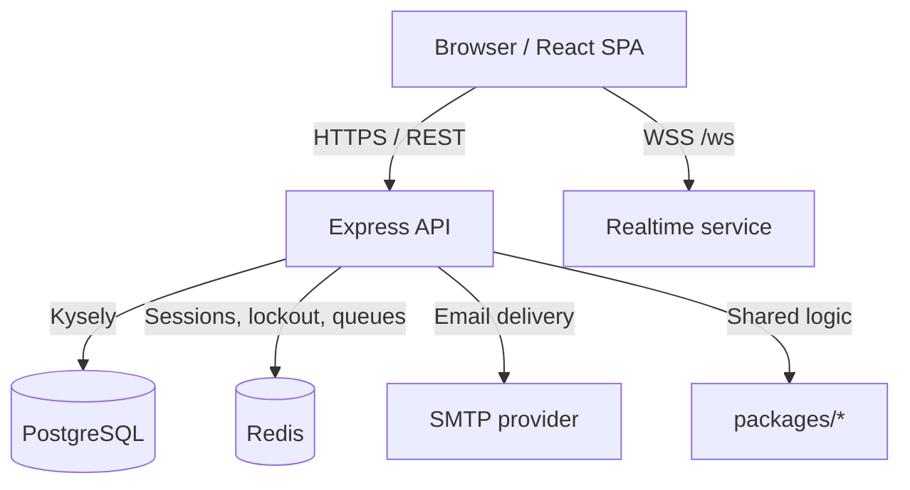

# HandoverKey System Architecture

This document describes the architecture that is currently implemented in this
repository.

## System Overview

HandoverKey is a Turbo monorepo with:

- `apps/web`: React 19 SPA
- `apps/api`: Express 5 API
- `packages/crypto`: browser/server crypto helpers
- `packages/database`: Kysely client and repositories
- `packages/shared`: shared types, validation helpers, and utilities

The deployed system is a single API service plus a single SPA, backed by PostgreSQL,
Redis, SMTP, and an authenticated WebSocket endpoint.

## Runtime Topology



## Monorepo Boundaries

### `apps/web`

Responsibilities:

- authentication UX
- client-side encryption and decryption
- vault, activity, sessions, admin, and successor pages
- realtime notifications
- public successor access and secure check-in flows

Key constraints:

- API calls go through `src/services/api.ts`
- protected routes are wrapped in `ProtectedRoute`
- auth state is managed via `AuthContext`

### `apps/api`

Responsibilities:

- HTTP API under `/api/v1/*`
- authentication, sessions, and profile management
- vault CRUD and encrypted import/export
- successor verification and access control
- inactivity orchestration and background jobs
- realtime WebSocket fan-out
- health, metrics, admin, and contact endpoints

Internal layering:

- `routes/` -> `controllers/` -> `services/` -> `repositories/`

### `packages/crypto`

Responsibilities:

- AES-256-GCM encryption helpers
- PBKDF2 key derivation helpers
- Shamir's Secret Sharing utilities

### `packages/database`

Responsibilities:

- database client setup
- Kysely schema and migrations
- repository abstraction for core entities

### `packages/shared`

Responsibilities:

- shared types and constants
- validation and sanitization helpers
- vault-related shared logic

## Dependency Direction

```text
apps/api -> packages/database, packages/crypto, packages/shared
apps/web -> packages/shared
packages/shared -> packages/crypto
packages/database -> standalone
packages/crypto -> standalone
```

Circular dependencies across packages are intentionally avoided.

## Core Data Flows

### Encrypted Vault Flow

1. The browser derives keys from the user's password.
2. Vault payloads are encrypted client-side with AES-256-GCM.
3. The API stores encrypted blobs, metadata, and salts only.
4. The server never needs plaintext vault contents to serve normal CRUD flows.

### Authentication Flow

1. User registers and verifies email.
2. User logs in through `/api/v1/auth/login`.
3. API issues JWT-backed cookies and records a server-side session.
4. Protected routes validate both the token and the backing session record.
5. Optional TOTP 2FA adds a second factor during login and account settings changes.

### Inactivity And Handover Flow

1. User activity is recorded from authenticated actions and explicit check-ins.
2. Background jobs evaluate inactivity thresholds and schedule reminders.
3. If the threshold is exceeded, the system opens a grace period.
4. Manual or token-based check-in can cancel an active grace period.
5. Verified successors receive the appropriate handover access once the flow completes.

### Realtime Flow

1. Authenticated clients connect to `/ws`.
2. The API associates connections with a user session.
3. Reminder and handover events are pushed back to that user's clients.
4. The web app surfaces those events through toast notifications and live UI refreshes.

## Persistence And Infrastructure

### PostgreSQL

Primary persistent store for:

- users
- sessions
- vault entries
- successors and assigned entry mappings
- inactivity settings
- activity logs
- notification deliveries
- handover processes and system status

### Redis

Used for:

- BullMQ queues and workers
- account lockout counters
- low-latency operational state

### Background Jobs

Current scheduled/processed job families include:

- inactivity checks
- reminder delivery
- handover execution
- session cleanup
- warning emails
- operational cleanup tasks

## Security Architecture

Key architectural choices:

- client-side encryption for vault contents
- httpOnly cookie auth for browsers
- optional bearer-token support for API clients
- explicit CORS allowlist
- request validation with Zod
- request sanitization and prototype-pollution defenses
- HMAC-signed activity records
- email-based successor verification

See `docs/security.md` for the implemented security model and current limitations.

## Observability

The API exposes:

- `/health` for service health
- `/metrics` for Prometheus scraping
- structured logs via Pino

Health output includes database, Redis, background job manager, and realtime status.

## What This Repo Is Not

The current repository does **not** ship:

- a microservice mesh
- RabbitMQ or Kafka
- mobile or CLI clients
- WebAuthn/passkeys
- object-storage-backed file handling

Those may be future directions, but they are not part of the implemented runtime today.

---

**Last Updated**: 2026-03-18
**Version**: 2.0.0
